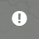
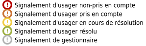
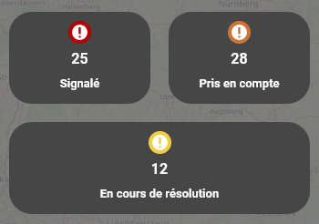

Carte signalement
=================

Cette carte vous permet de visualiser et gérer les signalements d'anomalies cyclable sur les itinéraires qui ont activé l'outil. **Il peut être déployé sur tout itinéraire présent dans l'Observatoire national des véloroutes**.

Basé sur la contribution des cyclistes et sur une identification fine des maîtres d'ouvrage et/ou des gestionnaires, l'outil de signalement offre une solution simple et transparente à la gestion d'anomalies. L'usager est assuré que son information est transmise à la bonne personne et cette dernière lui notifie ensuite la résolution du problème rencontré.

Pour plus d'informations sur comment le déployer, son fonctionnement général ou ses connexions avec d'autres outils (FVT, Suricate), vous pouvez vous rendre sur `le site du Réseau vélo et marche <https://www.velo-territoires.org/observatoires/outil-signalement-anomalies-cyclables/>`_, cette page étant dédiée à l'utilisation de l'outil sur Velodatamap.

Un **webinaire** de présentation de cette carte s'est tenu en octobre 2024, dont vous pouvez visionner l'enregistrement `ici <https://www.velo-territoires.org/ressources/videotheque/gerer-les-signalements-et-diffuser-de-linformation-aux-usagers-des-veloroutes/>`_.

Pour savoir comment interroger les données, les filtrer ou afficher la légende, lisez la page des :ref:`Fonctionnalités générales`.

Consulter des signalements
--------------------------

Les signalements sont consultables par toute personne, ayant un compte Velodatamap ou non, accédant à la carte. En mode connecté, vous n'aurez accès qu'aux signalements et itinéraires correspondant à vos restrictions géographiques et d'itinéraires. Cela permet de vous concentrer sur les données qui vous intéressent.

Les signalements créés par des gestionnaires sont en gris, quel que soit leur statut de résolution. Les signalements créés par des usagers sont déclinés en quatre couleurs (rouge, orange, jaune, vert) correspondant aux quatre statuts de résolution (``Signalé``, ``Pris en compte``, ``En cours de résolution``, ``Résolu``). Cela permet aux gestionnaires de concentrer leur attention sur les signalements d'usagers et pas sur les signalements qu'ils ont eux-même créés.

Créer un signalement
--------------------

Mode public
^^^^^^^^^^^

La carte « Signalement » est accessible à toute personne souhaitant consulter les signalements ou en créer un, sans avoir besoin de se connecter ou d'avoir un compte Velodatamap.

.. dropdown:: Lancer l'animation « Créer un signalement »
   :animate: fade-in-slide-down
   
   .. figure:: images/gifs/creation_signalement_usager.gif

Mode connecté
^^^^^^^^^^^^^

Les seuls utilisateurs ayant accès à la carte « Signalement » en mode connecté sont les **gestionnaires et maîtres d'ouvrage identifiés** le long des itinéraires ayant déployé l'outil.
Davantage de champs leur sont accessibles lors de la création d'un signalement :

- ``Date de début de validité`` et ``Date de fin de validité`` : permettent de définir une période de validité pour un signalement. Ces champs ne sont disponibles que pour les catégories de signalement ``Chaussée`` et ``Travaux``. Un signalement ayant une date de fin de validité sera automatiquement archivé la nuit suivant la date renseignée, vous n'aurez ainsi pas à retourner sur Velodatamap pour le faire manuellement.
- ``Document complémentaire`` : permet de renseigner une URL vers un document externe (arrêté municipal, plan de déviation...)

De plus, certains champs sont automatiquement renseignés :

- ``Email`` : automatiquement renseignée à partir de l'adresse rattachée au compte Velodatamap
- ``Statut`` : fixé par défaut à ``En cours de résolution``. Ce statut reste modifiable pendant la création d'un signalement si besoin

.. dropdown:: Lancer l'animation « Créer un signalement »
   :animate: fade-in-slide-down
   
   .. figure:: images/gifs/creation_signalement_mo.gif

Modifier un signalement
-----------------------

Seuls les gestionnaires ayant un compte Velodatamap peuvent modifier des signalements. Un utilisateur ne peut modifier que les signalements correspondant à sa restriction géographique, qui devraient être les seuls à apparaître sur son écran de toute façon.

Les gestionnaires peuvent apporter une réponse et des compléments d'information à la personne ayant créé le signalement en renseignant les champs ``Commentaire du gestionnaire``, ``Document complémentaire`` et ``Photo``.

Le statut d'un signalement peut être modifié pour refléter l'évolution de la prise en charge de l'anomalie. Lorsqu'une anomalie est résolue, le statut ``Résolu`` entraînera l'archivage du signalement après une semaine, et donc sa disparition de la carte. Ce délai permet à la personne ayant effectué le signalement de consulter les dernières mises à jour du gestionnaire avant l'archivage du signalement.

.. dropdown:: Lancer l'animation « Modifier un signalement »
   :animate: fade-in-slide-down
   
   .. figure:: images/gifs/modification_signalement.gif

Supprimer un signalement
------------------------

La suppression d'un signalement n'est pas autorisée ; seul le Réseau vélo et marche a le pouvoir de le faire. Si vous avez une bonne raison de vouloir supprimer un signalement au lieu de le passer en statut ``Résolu`` (doublon, erreur manifeste, etc.), merci de contacter la cellule SIG du Réseau vélo et

Obtenir des indicateurs sur les signalements
--------------------------------------------

Vous pouvez voir d'un coup d'œil le **nombre de signalements actifs** le long de votre itinéraire en cliquant sur |module_signalements| dans la barre de droite. Sélectionnez ensuite l'itinéraire voulu, et le nombre de signalements catégorisé par statut (Signalé, Pris en compte...) s'affichera juste en-dessous.

Si vous souhaitez accéder à des indicateurs plus complets, cliquez sur |requeteur| dans la barre de droite. Trois onglets vous présentent différents types d'indicateurs liés à vos itinéraires.

- **Indicateurs généraux** : cet onglet présente une demi-douzaine d'indicateurs, déclinés selon trois temporalités. Les chiffres correspondent à la somme des signalements recueillis dans la période donnée. Les trois périodes de référence sont : depuis le 1er janvier de l'année en cours ; depuis 365 jours ; depuis la création du premier signalement sur cet itinéraire (date variable selon l'itinéraire). Exemple : l'indicateur "créés par des usagers et résolus depuis le 1er janvier" représente le nombre de signalements créés après le 1er janvier de l'année en cours ET résolus à l'heure actuelle.
- **(Indicateurs) par année et catégorie** : cet onglet présente la somme de signalements créés lors de chaque année civile classés par provenance (maîtres d'ouvrage ou usagers), catégorie (Travaux, Signalisation…) et statut (Signalé, Pris en compte, En cours de résolution, Résolu). Le statut retenu est celui à la date du 31/12 de l'année observée. Exmeple: cela permet d'observer le statut au 31/12/2022 des signalements créés entre le  01/01/2022 et le 31/12/2022.
- **(Indicateurs) par catégorie (J-365)** : cet onglet présente la somme de signalements créés lors des 365 derniers jours classés par provenance (maîtres d'ouvrage ou usagers), catégorie (Travaux, Signalisation…) et statut actuel (Signalé, Pris en compte, En cours de résolution, Résolu).											

Comme expliqué dans la section ``Télécharger des données`` de la page :ref:`Fonctionnalités générales`, vous pouvez filtrer et télécharger les lignes de votre choix dans chaque onglet en cliquant sur |telechargement_tabulaire|.

Pour générer un rapport Excel complet sur votre itinéraire, cliquez sur |extraction| puis sur ``Rapport signalement``. Le rapport sera généré pour un itinéraire entier, la sélection de lignes dans les onglets du requêteur n'a aucune conséquence sur ce rapport exhaustif. Après avoir indiqué l'itinéraire pour lequel vous souhaitez un rapport ainsi que renseigné votre mot de passe, vous recevrez par mail un fichier Excel (vérifiez dans vos indésirables).
