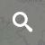
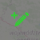
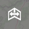
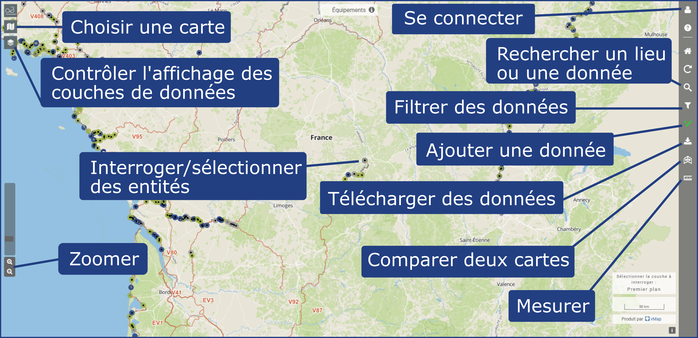

Fonctionnalités générales
=========================

.. _Fonctionnalités générales:

.. |cartes| image:: images/icons/cartes.png
            :width: 30
.. |couches| image:: images/icons/couches.png
            :width: 30

.. |modifier| image:: images/icons/modifier.png
            :height: 30

.. |requeteur| image:: images/icons/requeteur.png
            :width: 30
.. |extraction| image:: images/icons/extraction.png
.. |telechargement_tabulaire| image:: images/icons/telechargement_tabulaire.png
            :width: 30

Les principales fonctionnalités de Velodatamap, utiles dans plusieurs des cartes disponibles, sont résumées sur l'image ci-dessous, et chacune d'entre elle est présentée via une image animée (GIF) plus bas.

.. note::
   Si les GIFs qui suivent sont trop petits pour vous, n'hésitez pas à les agrandir avec un clic-droit et l'option « Ouvrir l'image dans un nouvel onglet »

.. dropdown:: Circuler entre les cartes
   :animate: fade-in-slide-down

   Velodatamap a quatre cartes principales : **Véloroutes**, **Équipements**, **Signalement** et **Aménagements**.
   Vous pouvez circuler entre les différentes cartes en cliquant sur l'icône |cartes| puis en cliquant sur l'une d'entre elles :

   .. only:: html

      .. figure:: images/gifs/cartes.gif

.. dropdown:: Activer les différentes couches de données
   :animate: fade-in-slide-down

   Différentes couches de données peuvent être affichées sur chaque carte. Certaines s'affichent par défaut dès le chargement, et d'autres sont désactivées par défaut mais peuvent vous être utiles !
   Cliquez sur |couches| pour accéder à l'interface suivante :

   .. only:: html

      .. figure:: images/gifs/couches.gif

.. dropdown:: Afficher la légende
   :animate: fade-in-slide-down

   Besoin de comprendre les données qui s'affichent sur la carte ? Affichez la légende propre à chaque carte, toujours en cliquant sur |couches| :

   .. only:: html

      .. figure:: images/gifs/legende.gif

.. dropdown:: Faire une recherche parmi les données
   :animate: fade-in-slide-down

   Besoin de chercher une donnée en particulier ? Utilisez le bouton |rechercher| pour accéder à l'interface suivante :

   .. only:: html

      .. figure:: images/gifs/rechercher.gif

.. dropdown:: Filtrer graphiquement les données
   :animate: fade-in-slide-down

   Si vous souhaitez n'afficher que certaines données d'une couche, alors cliquez sur le bouton |filtrer| et suivez la démarche ci-dessous. Si vous souhaitez télécharger le résultat de votre filtre, celui-ci sera actif automatiquement dans le requêteur à son ouverture. Le cas échéant, n'oubliez pas de sélectionner l'option « Filtre en cours » !

   .. only:: html

      .. figure:: images/gifs/filtrer.gif

.. dropdown:: Créer une entité
   :animate: fade-in-slide-down

   Pour créer une entité, que ce soit un signalement, un équipement ou un regroupement, assurez-vous d'être connecté·e, ce qui est le cas si l'icône en haut à droite est |connecte|. Cliquez ensuite sur |ajout_entite| et laissez-vous guider par l'animation suivante :

   .. only:: html

      .. figure:: images/gifs/ajout_entite.gif

.. dropdown:: Modifier une entité
   :animate: fade-in-slide-down

   Pour modifier une entité, assurez-vous d'être connecté·e, ce qui est le cas si l'icône en haut à droite est |connecte|. Sélectionnez ensuite l'entité que vous souhaitez modifier en cliquant dessus, appuyez sur |modifier| et n'oubliez pas de |enregistrer| : 

   .. only:: html

      .. figure:: images/gifs/selectionner_et_modifier.gif

.. dropdown:: Télécharger des données
   :animate: fade-in-slide-down

   Toutes les données téléchargeables des cartes véloroutes et équipements sont utilisables sous les conditions de la licence `Open Data Commons Open Database License v1.0 <https://opendatacommons.org/licenses/odbl/summary/>`_.
   
   Pour accéder à l'interface de téléchargement, le requêteur, cliquez sur |requeteur|. Téléchargez des fichiers géolocalisés au format de votre choix en cliquant sur le bouton |extraction| ; ils comprendront tous les attributs nécessaires à une bonne exploitation de la donnée. Si vous n'avez besoin que d'un fichier tabulaire ne comprenant que les colonnes s'affichant dans le requêteur, vous pouvez directement cliquer sur |telechargement_tabulaire|.
   N'hésitez pas à utiliser les filtres qui vous permettront de n'obtenir que les données dont vous avez réellement besoin.
   
   Une fois la demande formulée, vous recevrez un mail à l'adresse renseignée contenant un lien de téléchargement de votre fichier. Le traitement de votre demande peut prendre plusieurs minutes.

   .. only:: html

      .. figure:: images/gifs/telecharger.gif

.. dropdown:: Comparer des cartes
   :animate: fade-in-slide-down

   Pour comparer différentes cartes entre elles, il suffit de cliquer sur |comparer| et de choisir la carte avec laquelle vous souhaitez comparer votre carte actuelle. Le zoom des deux cartes est ajusté automatiquement pour rester identique. Vous ne pourrez pas sélectionner et interroger les entités de la carte de droite.

   .. only:: html

      .. figure:: images/gifs/comparer.gif

.. dropdown:: Mesurer des distances
   :animate: fade-in-slide-down

   Mesurer des distances peut être utile, par exemple pour estimer le périmètre d'un regroupement d'équipements avant de l'implanter sur la carte. Le bouton |mesurer| est tout en bas à droite de l'écran.
   
   .. only:: html

      .. figure:: images/gifs/mesurer.gif
