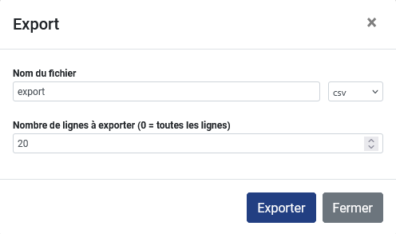

Tableaux de données
============================

Un module distinct permet de visualiser des données non géographiques sous forme de tableaux. Il est accessible en cliquant sur le logo en haut à gauche de l'écran, puis sur |tableaux|, ou par lien direct à l'adresse `suivante <https://velodatamap.velo-territoires.org/vmap/dashboard/manage_data/>`_.

Il suffit ensuite de sélectionner un thème pour accéder aux tableaux qui y sont associés. Il est aussi possible de faire défiler l'écran vers le bas pour avoir directement accès à tous les tableaux.

Description des tableaux disponibles
------------------------------------

.. dropdown:: Chiffres des véloroutes par territoire

   Ces tableaux présentent des chiffres-clefs pour chaque véloroute inscrite à l'Observatoire National des Véloroutes (ONV), territoire par territoire. Ils sont mis à jour quotidiennement à partir des données de l'ONV consultables sur les cartes « Véloroutes ». Ces chiffres ne sont pour l'instant disponibles que pour la France métropolitaine.

   Chaque ligne du tableau représente la relation entre une véloroute et un territoire qu'elle traverse, par exemple le nombre de kilomètres de voirie que la V85 emprunte dans le département du Gard, ou le nombre d'EPCI que la V85 traverse au sein du département du Gard.

   Ces chiffres prennent en compte le linéaire total de chaque véloroute, alors que deux véloroutes peuvent partager une partie de leur tracé. Il est donc possible de faire des sommes de longueurs en regroupant par véloroute. Il n'est par contre pas possible d'additionner des longueurs de voiries de différentes véloroutes en regroupant par territoire, au risque de compter deux fois les mêmes voiries (voir les tableaux ci-après pour cet usage).

   Champs visibles :

   - ``Véloroute (identifiant RVM)`` : identifiant national RVM attribué à la véloroute
   - ``Véloroute (nom)`` : nom complet de la véloroute
   - ``Niveau de schéma`` : niveau de schéma auquel appartient la véloroute
   - ``Commune``, ``EPCI``, ``Département``, ``Région`` : si existant, nom (code INSEE) du territoire référence par rapport auquel les chiffres sont calculés
   - ``Longueur totale (km)`` : longueur totale des voiries empruntées, ou en projet de l'être, par la véloroute (dans le territoire référence)
   - ``Site propre réalisé (km)`` : longueur totale des voiries en site propre empruntés par la véloroute et dont l'aménagement et balisage sont réalisés (dans le territoire référence)
   - ``Site partagé réalisé (km)`` : longueur totale des voiries en site partagé empruntées par la véloroute et dont l'aménagement et balisage sont réalisés (dans le territoire référence)
   - ``Non réalisé (km)`` : longueur totale des voiries en projet d'être aménagées, balisées et empruntées par la véloroute (dans le territoire référence)
   - ``Taux de réalisation (%)`` : (Site propre réalisé + Site partagé réalisé)/Longueur totale. Donne une idée de l'état de réalisation de la véloroute dans le territoire référence par rapport aux projets connus
   - ``Site propre réalisé année N`` : longueur totale des voiries en site propre dont l'aménagement et le balisage ont été réalisés lors de l'année civile actuelle (dans le territoire référence)
   - ``Site partagé réalisé année N`` : longueur totale des voiries en site partagé dont l'aménagement et le balisage ont été réalisés lors de l'année civile actuelle (dans le territoire référence)
   - ``Site propre réalisé année N-1`` (et N-2, N-3, etc.) : longueur totale des voiries en site propre dont l'aménagement et le balisage ont été réalisés lors de l'année civile actuelle moins 1 année, ou 2, 3, etc. (dans le territoire référence)
   - ``Site partagé réalisé année N-1`` (et N-2, N-3, etc.) : longueur totale des voiries en site partagé dont l'aménagement et le balisage ont été réalisés lors de l'année civile actuelle moins 1 année, ou 2, 3, etc. (dans le territoire référence)
   - ``EPCI``, ``Département``, ``Région`` : si existant, nom (code INSEE) des territoires auxquels appartient le territoire référence
   - ``Nombre de communes/EPCI/départements/régions traversé(e)s`` : si existant, nombre des territoires de l'échelon inférieur à celui du territoire référence traversés par la véloroute au sein du territoire référence
   - ``Communes/EPCI/départements/régions traversé(e)s`` : si existant, nom (code INSEE) des territoires de l'échelon inférieur à celui du territoire référence traversés par la véloroute au sein du territoire référence

   Des champs supplémentaires comme l'historique des réalisations jusqu'à l'année N-5 sont disponibles dans les fichiers téléchargés à partir des tableaux.

.. dropdown:: Chiffres des niveaux de schéma de véloroutes par territoire

   Ces tableaux présentent des chiffres-clefs pour chacun des niveaux de schéma de véloroutes de l'ONV, territoire par territoire. Il y a quatre niveaux de schémas : européen (EuroVelo), national, régional, départemental. Ils sont mis à jour quotidiennement à partir des données de l'ONV gérées par le Réseau vélo et marche. Ces chiffres ne sont pour l'instant disponibles que pour la France métropolitaine.

   Chaque ligne du tableau représente la relation entre un niveau de schéma et un territoire, par exemple le nombre de kilomètres de voirie inscrits à un schéma départemental des véloroutes dans la Communauté de communes Gorges Causses Cévennes, ou le taux de réalisation des voiries inscrites à un schéma départemental au sein de cette même communauté de communes.

   Ces chiffres prennent en compte le niveau de schéma le plus haut attribué à chaque voirie. Si une voirie est empruntée par une véloroute européenne, trois véloroutes nationales et une véloroute départementale, elle ne sera comptée que comme appartenant au niveau de schéma européen. De même, une voirie empruntée par une véloroute régionale et trois véloroutes départementales ne sera comptée que comme appartenant au niveau de schéma régional. Il est donc possible de faire des sommes de longueurs en regroupant par territoire et niveau de schéma, car chaque voirie n'est comptée que dans une seule ligne par tableau. Il n'est par contre pas possible de déduire la longueur d'une véloroute à partir de ces tableaux (voir les tableaux ci-dessus pour cet usage).

   Champs visibles :

   - ``Commune``, ``EPCI``, ``Département``, ``Région`` : si existant, nom (code INSEE) du territoire référence par rapport auquel les chiffres sont calculés
   - ``Niveau de schéma`` : niveau de schéma référence par rapport auquel les chiffres sont calculés
   - ``Véloroutes (identifiant RVM)`` : identifiant national RVM attribué aux véloroutes appartenant au niveau de schéma référence et traversant le territoire référence
   - ``Véloroutes (nom)`` : nom complet des véloroutes appartenant au niveau de schéma référence et traversant le territoire référence
   - ``Nombre de véloroutes`` : nombre de véloroutes appartenant au niveau de schéma référence et traversant le territoire référence
   - ``Longueur totale (km)`` : longueur totale des voiries inscrites au niveau de schéma référence dans le territoire référence
   - ``Site propre réalisé (km)`` : longueur totale des voiries en site propre dont l'aménagement et balisage sont réalisés (inscrites au niveau de schéma référence dans le territoire référence)
   - ``Site partagé réalisé (km)`` : longueur totale des voiries en site partagé dont l'aménagement et balisage sont réalisés (inscrites au niveau de schéma référence dans le territoire référence)
   - ``Non réalisé (km)`` : longueur totale des voiries en projet d'être aménagées, balisées et empruntées (inscrites au niveau de schéma référence dans le territoire référence)
   - ``Taux de réalisation (%)`` : (Site propre réalisé + Site partagé réalisé)/Longueur totale. Donne une idée de l'état de réalisation du niveau de schéma référence dans le territoire référence par rapport aux projets connus
   - ``Site propre réalisé année N`` : longueur totale des voiries en site propre dont l'aménagement et le balisage ont été réalisés lors de l'année civile actuelle (inscrites au niveau de schéma référence dans le territoire référence)
   - ``Site partagé réalisé année N`` : longueur totale des voiries en site partagé dont l'aménagement et le balisage ont été réalisés lors de l'année civile actuelle (inscrites au niveau de schéma référence dans le territoire référence)
   - ``Site propre réalisé année N-1`` (et N-2, N-3, etc.) : longueur totale des voiries en site propre dont l'aménagement et le balisage ont été réalisés lors de l'année civile actuelle moins 1 année, ou 2, 3, etc. (inscrites au niveau de schéma référence dans le territoire référence)
   - ``Site partagé réalisé année N-1`` (et N-2, N-3, etc.) : longueur totale des voiries en site partagé dont l'aménagement et le balisage ont été réalisés lors de l'année civile actuelle moins 1 année, ou 2, 3, etc. (inscrites au niveau de schéma référence dans le territoire référence)
   - ``EPCI``, ``Département``, ``Région`` : si existant, nom (code INSEE) des territoires auxquels appartient le territoire référence
   - ``Nombre de communes/EPCI/départements/régions traversé(e)s`` : si existant, nombre des territoires de l'échelon inférieur à celui du territoire référence traversés par la véloroute au sein du territoire référence

   Des champs supplémentaires comme l'historique des réalisations jusqu'à l'année N-5 sont disponibles dans les fichiers téléchargés à partir des tableaux.

Filtrer et télécharger des données
----------------------------------

N'hésitez pas à utiliser et combiner les filtres qui vous permettront de n'obtenir que les données dont vous avez réellement besoin. Pour filtrer sur les valeurs d'un champ, par exemple ``commune``, vous avez le choix entre plusieurs opérateurs de comparaison. Ces opérateurs comparent la valeur du champ filtré pour chaque donnée à la valeur que vous renseignez dans le filtre. Les opérateurs disponibles sont :

- ``~`` renvoie les données pour lesquelles le champ filtré contient la valeur renseignée de filtre. Équivalent de l'opérateur SQL ``ILIKE``. Exemple de données renvoyées pour le filtre ``commune ~ lyon`` : données pour lesquelles ``commune = Sainte-Foy-lès-Lyon``
- ``=`` renvoie les données pour lesquelles le champ filtré est strictement égal à la valeur de filtre. Exemple de données renvoyées pour le filtre  ``commune = Sainte-Foy-lès-Lyon`` : données pour lesquelles ``commune = Sainte-Foy-lès-Lyon``
- ``est parmi`` renvoie les données pour lesquelles le champ filtré est comprise dans la sélection de valeurs que vous renseignerez. Équivalent de l'opérateur SQL ``IN``. Exemple de données renvoyées pour le filtre ``commune est parmi Sainte-Foy-lès-Lyon, Lyon, Paris`` : données pour lesquelles ``commune = Sainte-Foy-lès-Lyon``
- ``est vide`` renvoie les données pour lesquelles le champ filtré n'a pas de valeur. Exemple de données renvoyées pour le filtre  ``commune est vide`` : données pour lesquelles ``commune = null``
- ``n'est pas vide`` renvoie les données pour lesquelles le champ filtré a une valeur. Exemple de données renvoyées pour le filtre  ``commune n'est pas vide`` : données pour lesquelles ``commune = Sainte-Foy-lès-Lyon``

Vous pouvez combiner différents filtres de manière additive ou alternative en cliquant sur le bouton |filtre_et| |filtre_ou| à droite de la barre de filtre. Ce bouton n'apparaît qu'après avoir appliqué deux filtres.

Cliquez ensuite sur |telechargement_tableaux| pour télécharger le résultat de votre filtre. Vous pouvez choisir le nom du fichier exporté, son format (XLS disponible) et sélectionner le nombre de lignes à exporter (attention à bien mettre `0` si vous souhaitez exporter toutes les lignes).

