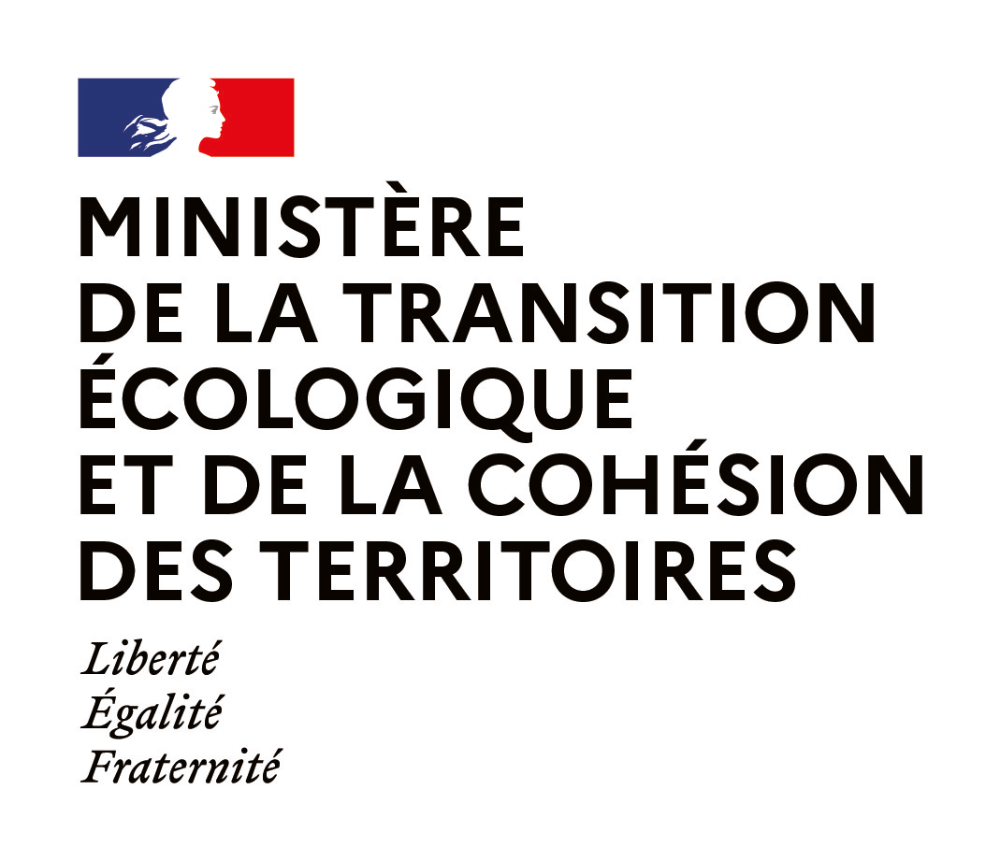

Velodatamap - documentation et tutoriel
=======================================

Velodatamap est le portail cartographique de `Vélo & Territoires <https://www.velo-territoires.org>`_ permettant de gérer, visualiser et télécharger des données autour des véloroutes françaises et des aménagements cyclables.

Sa consultation est libre, et les fonctionnalités d'édition et administration sont réservées aux collectivités territoriales aménageuses et promoteuses de véloroutes. Il est accessible en accès connecté à l'adresse `velodatamap.velo-territoires.org/vmap/login <https://velodatamap.velo-territoires.org/vmap/login>`_ et en consultation libre à l'adresse `velodatamap.velo-territoires.org <https://velodatamap.velo-territoires.org/vmap/widget/vmap?widget_id=Rs3fEeMD4nuxYaFSODnx31pOZ2vDVyZsi6iYxrHBgs5apibhTaY5fNoGCCvsa86i&token=3ea714da-0a95-11ee-8d8d-0ebf1343709c>`_.

Ce site est le manuel d'utilisation du portail, pour une description plus générale, rendez-vous sur `notre site <https://www.velo-territoires.org/observatoires/velodatamap/>`_.

**Contact** : en cas de question ou difficulté d'utilisation, veuillez nous contacter à l'adresse sig@velo-territoires.org

===================================

.. note::

   Documentation en cours d'écriture.

.. toctree::
   :titlesonly:

   Création et gestion de votre compte
   Fonctionnalités générales
   Carte véloroutes
   Carte équipements
   Carte signalement
   Carte aménagements cyclables
   Évolutions de Velodatamap
   Contact : sig@velo-territoires.org <mailto:sig@velo-territoires.org?body=http://>

Une subvention ministérielle finance la mise en œuvre du projet d'intérêt économique général de stratégie, coordination et visualisation géographique du Schéma national des véloroutes.
